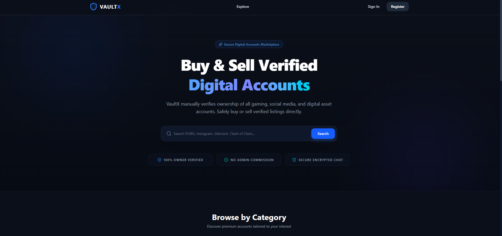

# VaultX : A full-stack secure gaming and social account marketplace.

Welcome to VaultX, a premium digital marketplace platform designed for trading, selling, and buying gaming accounts (e.g., PUBG, Valorant, Clash of Clans) and social media profiles. Built with a modern, high-performance tech stack, VaultX ensures trust and quality via a robust admin moderation workflow, direct real-time seller-to-buyer messaging, and advanced search filters.



## Features :
* **Robust Authentication**: Secure user registration, logins via HTTP-only JWT cookies, bcrypt password hashing, and token-based state checking.
* **Admin Moderation Dashboard**: A dedicated approval and rejection queue system for newly submitted listings, enabling admins to review details, levels, and screenshots, and providing feedback comments on rejection.
* **Real-Time Direct Chat**: Dynamic inbox messaging powered by Socket.io, complete with online/offline status indicators and instant message delivery.
* **Detailed Listing Management**: Filterable parameters (Category, Platform, Level, Country, Price range, and Date) along with detailed listing creation.
* **Image Hosting & Uploads**: Seamless multi-image uploads for listing screenshots and user profile avatar editing via Multer and Cloudinary CDN storage.
* **User Profile & Management**: Saved lists, listing management tables for editing/deleting posts, user profiles, and active listing tracking.

## Tech Stack

### Frontend:
* **React 19** - UI library utilizing the latest rendering features
* **Vite** - High performance bundler & frontend development environment
* **TypeScript** - Type-safe programming
* **Tailwind CSS 4** - Utility-first modern CSS framework
* **Zustand** - Minimal and performant global state stores
* **React Router Dom v7** - Single Page App layout and navigation router
* **Lucide React** - Vector iconography library
* **Axios** - Promise-based HTTP client for API communication
* **Socket.io Client** - Client-side real-time WebSocket connection listener

### Backend & Database:
* **Node.js** - JavaScript runtime environment
* **TypeScript** - Strict compiler and type safety on the backend
* **Express.js (v5)** - Fast and minimalist web framework
* **Prisma** - ORM framework for schema definition and migrations
* **PostgreSQL** - Relational database store
* **JsonWebToken & Bcrypt** - Session cookie tokens and credential hashing
* **Multer** - Upload handling middleware for multipart form-data
* **Cloudinary SDK** - Cloud storage for secure listing and avatar image hosting
* **Zod** - Parsing and validation schemas for API inputs

### Development Tools:
* **npm** - Dependency manager and command runner
* **Prisma CLI** - Database syncing and client generation tool

## Contributing & Installation

### Installation

1. **Clone the repository**
   ```bash
   git clone https://github.com/jeel779/vaultx.git
   
   # For Windows
   ren vaultx vaultx-portal
   
   # For Mac/Linux
   mv vaultx vaultx-portal
   
   cd vaultx-portal
   ```

2. **Install dependencies**
   ```bash
   # Install backend dependencies
   cd backend
   npm install
   
   # Install frontend dependencies
   cd ../frontend
   npm install
   ```

3. **Environment Setup**
   
   Create a `.env` file in the `backend/` directory:
   ```env
   PORT=8000
   DATABASE_URL="postgresql://<user>:<password>@<host>:<port>/<database>?sslmode=require"
   JWT_SECRET="your_jwt_secret_key"
   ADMIN_SECRET_KEY="your_admin_secret_key"
   CORS_ORIGIN="http://localhost:5173"
   NODE_ENV="development"

   # Cloudinary Credentials (for image hosting)
   CLOUDINARY_CLOUD_NAME="your_cloud_name"
   CLOUDINARY_API_KEY="your_api_key"
   CLOUDINARY_API_SECRET="your_api_secret"
   ```

   Create a `.env` file in the `frontend/` directory:
   ```env
   VITE_API_URL="http://localhost:8000/api/v1"
   ```

4. **Database Setup**
   ```bash
   cd ../backend
   npx prisma migrate dev
   npx prisma generate
   ```

5. **Start development server**
   
   In one terminal, start the backend:
   ```bash
   cd backend
   npm run dev
   ```
   
   In a second terminal, start the frontend:
   ```bash
   cd frontend
   npm run dev
   ```

## Folder Structure

```text
vaultx/
├── backend/
│   ├── prisma/                  # Prisma Database Schema
│   │   └── schema.prisma
│   ├── src/
│   │   ├── controllers/         # Express Controllers (admin, auth, listing, message, user)
│   │   ├── lib/                 # Shared client configurations (Prisma client, Socket helper)
│   │   ├── middlewares/         # JWT Verification & Multer config
│   │   ├── routes/              # API router endpoints
│   │   ├── utils/               # Custom errors, Cloudinary helpers, & validation schemas
│   │   ├── app.ts               # Express app setups and middlewares
│   │   └── index.ts             # Main entry point (starts server)
│   ├── tsconfig.json
│   └── package.json
│
├── frontend/
│   ├── public/                  # Static public assets
│   ├── src/
│   │   ├── assets/              # Web assets (images, icons)
│   │   ├── components/          # Reusable UI elements (Toasts, Modals, Filters, Chat Layouts)
│   │   ├── helpers/             # API request communicators
│   │   ├── lib/                 # Axios HTTP client configuration
│   │   ├── pages/               # Page routing views (Home, Explore, ListingDetails, Dashboards, Auth)
│   │   ├── stores/              # Zustand global states (admin, auth, chat, listings)
│   │   ├── types/               # TypeScript interfaces
│   │   ├── App.tsx              # Main App wrapper & route maps
│   │   ├── index.css            # Tailwind variables & global styles
│   │   └── main.tsx             # React entry point mounting file
│   ├── vite.config.ts
│   ├── tsconfig.json
│   └── package.json
└── README.md
```

## Naming Conventions

### Files & Folders:
* Use kebab-case or dot-convention for backend utility/route/controller files (e.g., `auth.controller.ts`, `auth.middleware.ts`).
* Component & Page files use PascalCase (e.g., `ListingCard.tsx`, `CreateListing.tsx`).
* Custom stores use camelCase prefixed with `use` (e.g., `useAuthStore.tsx`).
* REST Router files end with `.route.ts` (e.g., `listing.route.ts`).

### Components:
* React components use PascalCase.
* Component props interfaces use PascalCase ending with `Props` (e.g., `ListingCardProps`).
* Context/Zustand hooks start with `use` prefix.

### Database & API:
* Database models use PascalCase (Prisma convention).
* API endpoints return standard camelCase payloads.
* Enum values use UPPER_SNAKE_CASE (or lowercase string matching DB type schema).

### Variables & Functions:
* Use camelCase for variables and functions.
* Constants use UPPER_SNAKE_CASE.
* Boolean variables start with `is`, `has`, `can`, `should`.

## Core Enums Hierarchy

### User Roles:
* **Role**: `USER`, `ADMIN`

### Listing Statuses:
* **status**: `DRAFT`, `PENDING`, `VERIFIED`, `REJECTED`, `SOLD`

## Contribution
1. Fork the repository and clone your fork.
2. Make your contribution and raise a PR.
3. Follow the coding standards:
   - Use TypeScript for all new code.
   - Follow the established folder structure.
   - Include loading and error states for UI components.
4. Database Changes:
   - Run `npx prisma db push` or `npx prisma migrate dev` to verify schema updates.
5. Commit Guidelines:
   - Use conventional commits: `feat:`, `fix:`, `docs:`, `style:`, `refactor:`, `test:`, `chore:`
   - Write clear, descriptive commit messages.
